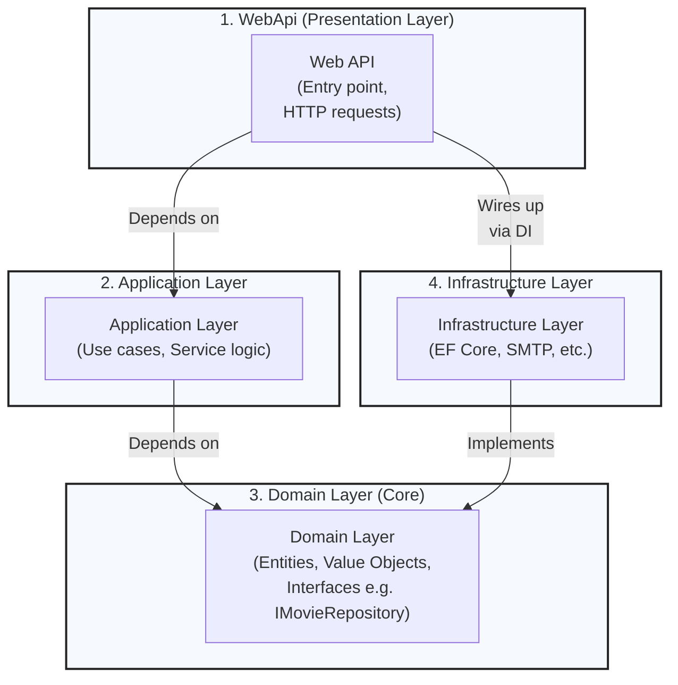

# IMDB Project

This is a .NET-based IMDB-like application with a clean architecture implementation.

## Project Structure

The solution is organized into several projects following clean architecture principles:

- **IMDB.Domain**: Contains the core business logic and domain entities
- **IMDB.Application**: Contains application logic, interfaces, and use cases
- **IMDB.Infrastructure**: Handles external concerns like data access and external services
- **IMDB.WebApi**: The API layer that handles HTTP requests and responses

## Technical Stack

- .NET 9.0
- Clean Architecture
- RESTful API

## Getting Started

### Prerequisites

- .NET 9.0 SDK
- Your preferred IDE (Visual Studio, Rider, VS Code)

### Building the Project

```bash
dotnet build
```

### Running the Application

```bash
cd IMDB.WebApi
dotnet run
```

## Architecture Diagram



The diagram above shows the dependencies between projects:

- IMDB.WebApi depends on both Application and Infrastructure layers
- IMDB.Application contains interfaces and depends only on the Domain layer
- IMDB.Infrastructure implements interfaces from Application and depends on Domain
- IMDB.Domain is the core and doesn't depend on any other layer

## Project Status

This project is currently under development.

## License

[Your chosen license]

---
*Note: This README is a template and should be updated with specific project details and requirements.*
